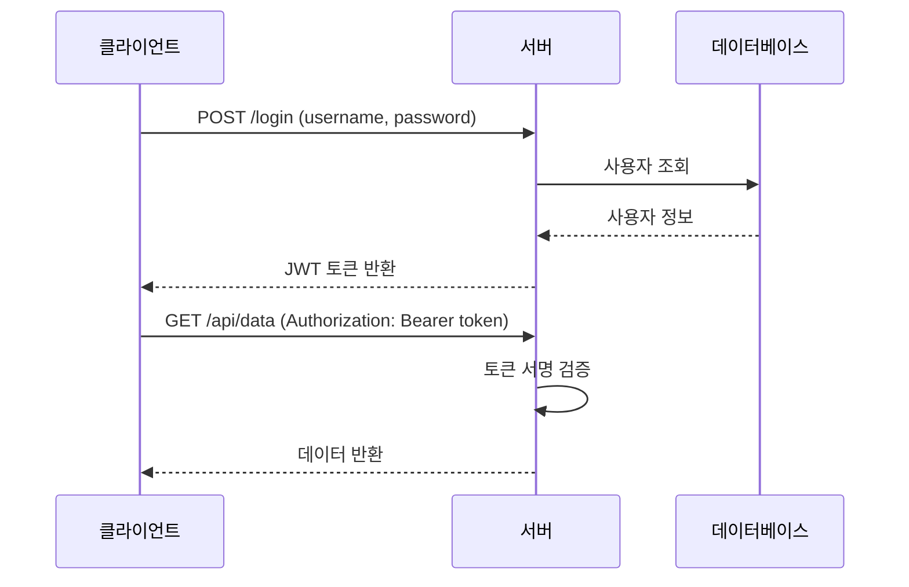
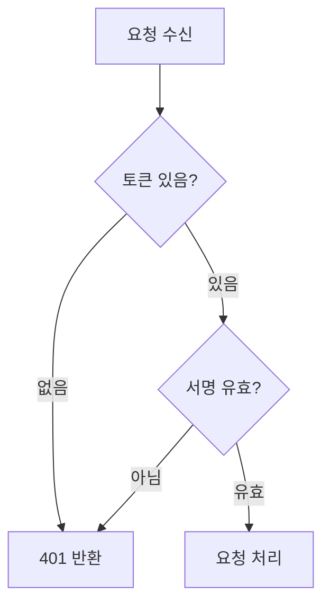

# 설명 문서 Guide (Explanation)

독자가 개념·원리·배경을 깊이 이해할 수 있도록 돕는 문서.

**PKM 용어 노트(Terminology note)는 이 유형의 특화 변형이다.** 학술 출처와 Literature Review가 필요하면 `terminology.md`를 사용하라.

## 두 가지 하위 유형

| 유형 | 특징 |
|------|------|
| **개념 이해 문서** | 특정 기술의 원리·작동 방식. 등장 배경 포함 |
| **도메인 문서** | 비즈니스 도메인 지식 (커머스, 금융, 소셜 등) |

## 작성 원칙

1. **등장 배경과 해결하는 문제 먼저** — 독자가 "왜 이게 필요한지" 납득해야 함
2. **원리를 논리적으로 전개** — 표면 설명이 아닌 작동 방식
3. **시각 자료 적극 활용** — 다이어그램, 흐름도, 표로 추상적 개념 시각화
4. **선행 지식 명시** — 독자가 미리 알아야 할 개념 안내

## 템플릿

```markdown
# [개념명]

[이 개념이 무엇이며 왜 중요한지 — 한 단락]

## 등장 배경

[왜 등장했는지, 기존 방식의 어떤 문제를 해결하는지]

## 원리

[작동 방식을 논리적으로. 다이어그램 권장]

\`\`\`
// 흐름도 또는 다이어그램 (ASCII, Mermaid 등)
\`\`\`

## 활용

[실제 프로젝트에서 어떻게 사용되는지. 예제 코드 포함]

## 관련 개념

- [관련 개념 1]: [한 줄 관계 설명]
- [관련 개념 2]: [한 줄 관계 설명]
```

## 비교 표 패턴 (Comparison Table)

기술 선택의 맥락을 설명할 때 대안과의 비교표가 이해를 빠르게 한다.

```markdown
## [이 기술] vs 대안

| 항목 | [이 기술] | [대안 A] | [대안 B] |
|------|----------|---------|---------|
| 상태 관리 | Stateless | Stateful | Stateless |
| 서버 부하 | 낮음 (토큰 자체 검증) | 높음 (DB 조회 필요) | 낮음 |
| 토큰 만료 전 무효화 | 어려움 | 즉시 가능 | 어려움 |
| 적합한 상황 | 마이크로서비스, API | 세션 기반 웹앱 | 단순 API |
```

## Mermaid 다이어그램 템플릿

흐름과 아키텍처는 텍스트보다 다이어그램이 명확하다.

**시퀀스 다이어그램** (요청-응답 흐름):
````markdown

````

**플로우차트** (의사결정 흐름):
````markdown

````

## 체크리스트

- [ ] "등장 배경" 또는 "왜 필요한가" 섹션이 있는가?
- [ ] 핵심 원리를 논리적으로 전개했는가? (표면 설명이 아닌 작동 방식)
- [ ] 추상적인 개념을 다이어그램 또는 표로 시각화했는가?
- [ ] 대안 기술과의 비교표가 있는가? (선택 맥락 제공)
- [ ] 선행 지식 또는 관련 개념을 안내했는가?
