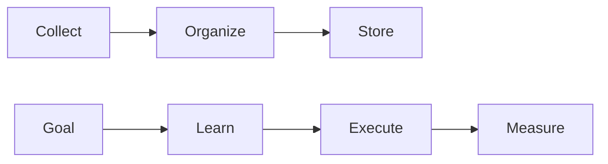
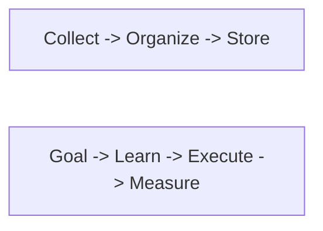
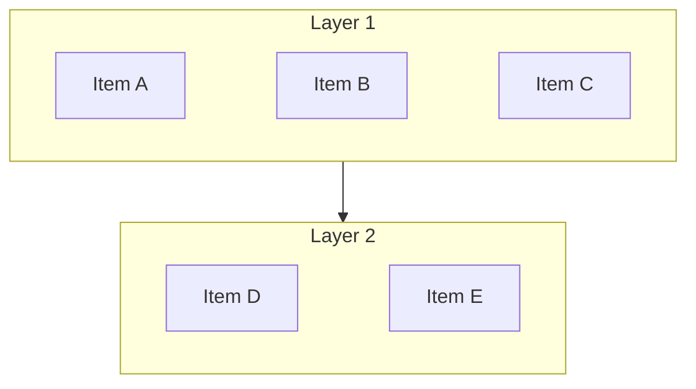
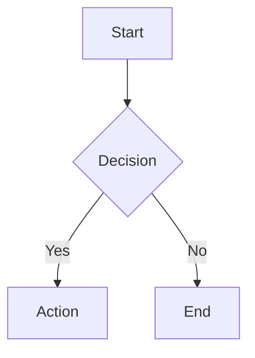
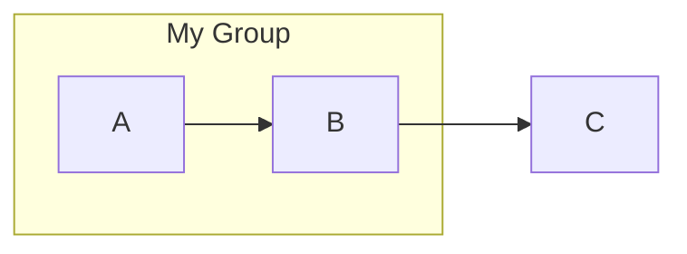
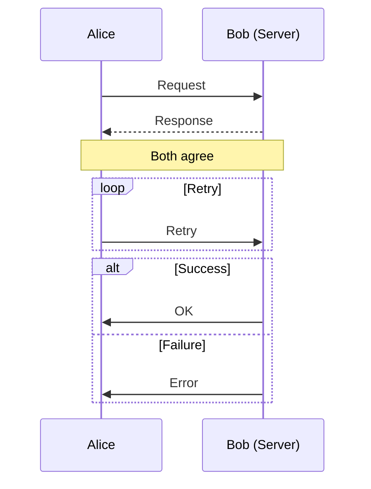
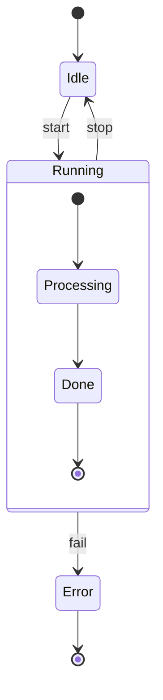
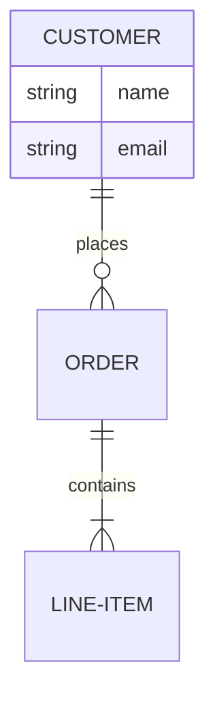
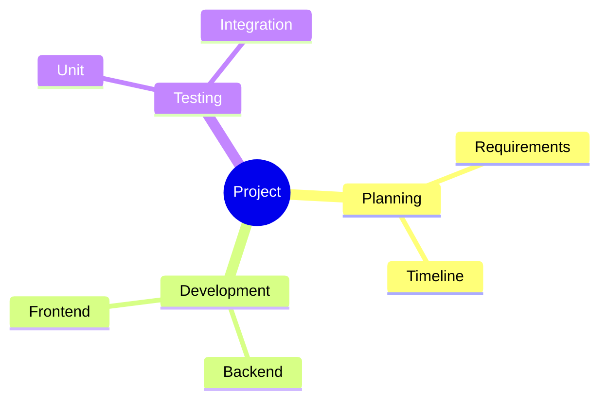

# Obsidian Mermaid Diagrams

Create Mermaid diagrams that render correctly in Obsidian and are easy to read at a glance.

## Core Principle: Simplicity First

A diagram exists to clarify, not to impress. If a reader can't grasp it in 3 seconds, simplify.

### Node Minimization

Sequential steps belong inside a single node, not spread across many:

**Before** (too many nodes):


**After** (sequential flow collapsed into text):


### Connection Minimization

- Show only the essential flow; explain details in surrounding prose
- Cap at 5 nodes and avoid crossing edges
- Split complex relationships into multiple simple diagrams

### When NOT to Use Mermaid

| Format | Best for | Example |
|--------|----------|---------|
| **Table** | Property-value pairs, comparisons, options | Energy levels by task |
| **Mermaid** | Flows, processes, feedback loops | Input -> Process -> Output |
| **Inline text** | Simple linear sequences | `A -> B -> C` |

Pick whichever format is most compact for the same information.

---

## Design Rules

### 1. Square Layout (TB + subgraph LR)

Pure `LR` gets too wide; pure `TB` gets too tall. Combine them:



- `flowchart TB`: overall flow top-to-bottom
- `direction LR`: items within each subgraph arranged horizontally
- `~~~`: invisible link for alignment (no arrow)

### 2. Keep Labels Short

Labels should be under 15 characters. Move details into the text below the diagram.

```
Node["Authentication Service"]     -- too long, breaks layout
Node[Auth]                         -- short, add detail in prose
```

### 3. No Markdown in Labels

No `<br/>`, numbered lists (`1.`), or headings (`##`) inside node labels — they cause rendering errors or produce unreadable diagrams. If a label needs a line break, the label is too long.

### 4. Safe Subgraph Names

Avoid special characters and leading numbers in subgraph names:

```
subgraph "1. Phase One"            -- may break
subgraph Phase_One["Phase One"]    -- safe
```

---

## Syntax Rules (Obsidian-specific)

1. **Always wrap in a `mermaid` code fence** — never raw Mermaid outside a fence.
2. **Never use bare lowercase `end`** as a node ID or label — it breaks the parser. Use `End`, `END`, or `"end"`.
3. **Never start a connection with lowercase `o` or `x`** — prefix with a space or capitalize. (`dev---ops` breaks; `dev--- Ops` works.)
4. **Wrap special characters in quotes** — `A["Label with (parens) & colon: here"]`.
5. **Use `%%` for comments** — HTML comments `<!-- -->` are invalid inside Mermaid.
6. **Stick to Mermaid v10 syntax** — Obsidian ships ~v10.x. Avoid v11+ features like `@{ shape: ... }`.
7. **Use `stateDiagram-v2`**, not `stateDiagram`.
8. **Skip `init` directives for theming** unless the user explicitly asks — Obsidian applies its own theme.

---

## Diagram Types

### Flowchart



**Direction:** `TD`/`TB` (top-down), `LR` (left-right), `RL`, `BT`

**Node shapes:** `[rect]` `(rounded)` `([stadium])` `[[subroutine]]` `[(cylinder)]` `((circle))` `{diamond}` `{{hexagon}}`

**Edges:** `-->` arrow, `---` open, `-.->` dotted, `==>` thick, `--|label|-->` labeled, `<-->` bidirectional

**Subgraph:**


### Sequence Diagram



**Arrows:** `->>` solid, `-->>` dotted return, `->` open, `-x` with X

**Keywords:** `participant`, `actor`, `activate`/`deactivate`, `Note over`/`right of`/`left of`, `loop`, `alt`/`else`, `opt`, `par`, `critical`, `break`

### State Diagram



**Keywords:** `[*]` start/end, `state`, `note right of`, `--` concurrency, `<<choice>>`, `<<fork>>`, `<<join>>`

### Entity Relationship Diagram



**Cardinality:** `|o` zero-or-one, `||` exactly-one, `}o` zero-or-more, `}|` one-or-more

### Mindmap



**Node shapes:** `((circle))`, `[square]`, `(rounded)`, `{{hexagon}}`, `)cloud(`

Indentation defines hierarchy — use consistent 2-space indent.

### Other Diagram Types

These are also supported in Obsidian — consult the [Mermaid docs](https://mermaid.js.org/) for syntax:

- **Class Diagram** (`classDiagram`) — classes, inheritance, associations
- **Gantt Chart** (`gantt`) — project timelines with tasks and dependencies
- **Pie Chart** (`pie`) — proportional data
- **Timeline** (`timeline`) — chronological events
- **User Journey** (`journey`) — user experience scoring
- **Git Graph** (`gitGraph`) — branch/merge visualization
- **Quadrant Chart** (`quadrantChart`) — 2x2 priority matrices

---

## Quality Checklist

Before finishing any diagram:

- [ ] No `<br/>`, numbered lists, or headings in node labels
- [ ] All labels under 15 characters
- [ ] No bare `end` as node ID
- [ ] No `o`/`x` starting a connection
- [ ] Special characters wrapped in quotes
- [ ] Square layout used if diagram is too tall or wide (TB + subgraph LR)
- [ ] Complex details moved to prose outside the diagram
- [ ] Tested rendering in Obsidian preview
